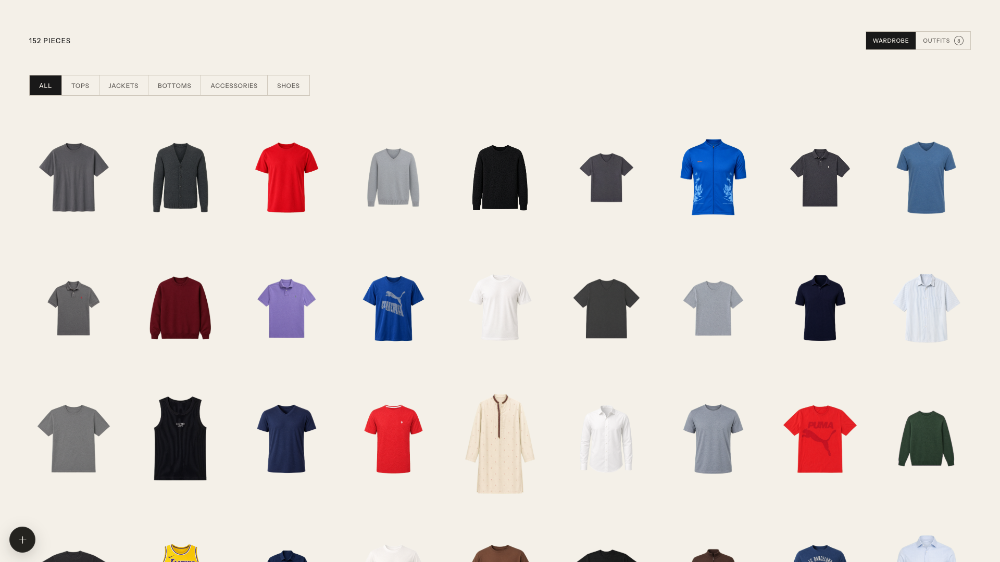
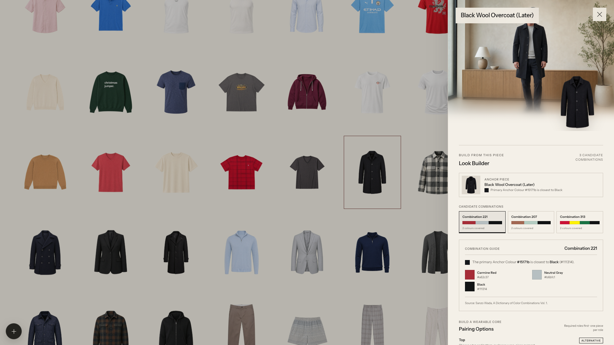
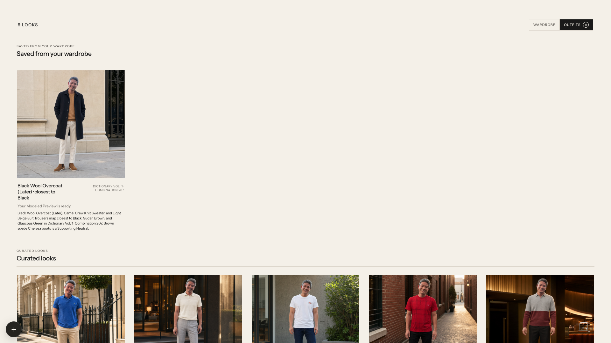

<div align="center">

# My Wardrobe

### Turn the clothes you actually own into considered, Wada colour-led outfits.

A local-first AI wardrobe with a **Wada Look Builder** at its heart. Start from any garment, explore colour combinations from Sanzo Wada's _A Dictionary of Color Combinations Vol. 1_, then build and save a wearable look from your own wardrobe.

[](LICENSE)
[](package.json)

</div>



## The Wada Look Builder

Most wardrobe apps stop at cataloguing. This fork is about the much more interesting next question: **what should I wear with this?** You do not need to know colour theory or arrive with a great eye for styling—the Look Builder gives you a practical starting point, using the clothes already in your wardrobe.

### What is Wada?

Sanzo Wada's _A Dictionary of Color Combinations_ is a visual reference book of ready-made colour palettes. Rather than asking you to decide whether two colours “go together” from scratch, it gives you a considered family of colours that work as a whole. This app uses the book's Vol. 1 dataset: 348 two-, three-, and four-colour combinations drawn from 159 colours.

That makes colour matching much less mysterious. Instead of memorising rules or chasing trends, you can start with a shirt, jacket, trouser, or shoe you already like, then use a tested palette as a guide for the rest of the outfit.

### How it turns a colour palette into something you can wear

1. **Start with an Anchor Piece.** Pick the garment you want to wear. The builder reads its dominant colour as the **Anchor Colour**.
2. **Find a helpful palette.** It maps that colour to the closest Wada colour, then shows up to three **Reference Combinations** that your wardrobe can actually cover—not a beautiful palette made up of clothes you do not own.
3. **Choose the rest by role.** For each combination, the app suggests matching tops, bottoms, footwear, layers, and accessories from your own clothes. A colour swatch and explanation show which Wada colour each suggestion is serving.
4. **Build a Wearable Core.** Complete the practical basics: a top and bottom (or one-piece garment) plus footwear. Then add a layer or accessory only if it helps the look.
5. **Save with confidence.** Once the outfit is complete, save it for a generated name, description, and optional Modeled Preview.

It is intentionally more than colour matching. A palette can be harmonious yet still make a strange outfit. The builder checks clothing context before it ranks colours, so it avoids suggestions such as athletic or swimwear in a tailored look. Black, white, cream, grey, and brown can act as **Supporting Neutrals**: useful grounding pieces that let the Wada colours lead without forcing every item to be a perfect swatch match.

Think of it as a friendly stylist with a clear brief: *begin with the piece you love, use colour to create harmony, then make sure the result makes sense for real life.* You choose every garment; Wada gives you a more confident route to choosing it.



### From a colour combination to an outfit you can wear

1. Pick an existing garment as the Anchor Piece.
2. Review the suggested Wada Reference Combinations and switch between them without losing valid selections.
3. Select a Wearable Core: a top and bottom (or one-piece) plus footwear. Add optional accessories or layers.
4. Save the Complete Look. The app creates an outfit name and description, generates a Modeled Preview, and checks that preview for identity, framing, and garment fidelity.
5. Keep, rename, retry, or delete a Saved Outfit. Deleting an outfit never removes the wardrobe pieces it uses.



## What this fork adds

- **Dictionary-guided Wada Look Builder** — the main feature: real Vol. 1 combinations, candidate coverage, Anchor Colour matching, and flexible combination switching.
- **Wearable, context-aware pairings** — role-based suggestions that avoid nonsensical combinations before colour ranking begins.
- **Complete Looks and Saved Outfits** — assemble an outfit from your own pieces, then rename or delete it without affecting the source wardrobe.
- **Modeled Preview with review** — optional full-look generation followed by a fidelity check before a preview is shown as ready.
- **Local-first personal data** — your wardrobe, reference image, generated assets, and API key remain on your machine.

## Bring your own wardrobe

- Import clothes from a photo, then approve the detected garment and its cut-out.
- Edit names, categories, colours, and detail tags when the initial detection needs help.
- Use the Wada Look Builder to turn those pieces into a look you would actually put on.
- Browse Curated Looks for additional inspiration alongside the looks you save yourself.

## Quick start

### Prerequisites

- Node.js 22 or newer
- An OpenAI API key
- A PNG identity reference photo for modeled previews

### Install and run locally

```bash
git clone https://github.com/newbie1668/mywardrobe.git
cd mywardrobe
npm ci
cp .env.example .env
```

Add your key to `.env`:

```dotenv
OPENAI_API_KEY=your_key_here
```

Place a PNG reference photo at `data/model-reference.png`, then start the app:

```bash
npm run dev
```

Open [http://localhost:5173](http://localhost:5173).

Image generation can take a little while because the app performs high-quality image generation and a separate fidelity review. The UI keeps the state visible while the job is generating, reviewing, ready, or needs a retry.

## Privacy: local by default

Do not commit or share these files:

- `.env` and API keys
- `data/`, including `data/model-reference.png`
- Original wardrobe photos and generated outfit images

They are ignored by Git in this repository. Treat a modeled image as personal data whenever it contains your likeness. The README screenshots are intentionally committed examples from the maintainer's local wardrobe; replace them with your own only if you are happy for those images to be public.

## Configuration

| Variable | Default | Purpose |
| --- | --- | --- |
| `OPENAI_API_KEY` | required | Used only by the local server for OpenAI requests. |
| `OPENAI_VISION_MODEL` | `gpt-5.4-mini` | Detects garments and reviews modeled previews. |
| `OPENAI_IMAGE_MODEL` | `gpt-image-2` | Generates garment and modeled images. |
| `OPENAI_IMAGE_QUALITY` | `high` | Image-generation quality. |
| `WARDROBE_MODEL_REFERENCE` | `data/model-reference.png` | Local PNG used for modeled images. |
| `WARDROBE_DATA_DIR` | `data` | Local directory for wardrobe data and generated assets. |

## Development and checks

```bash
npm test
npm run test:browser
npm run check
```

Before opening a pull request, keep personal files out of the commit and run the relevant checks above.

## Credits and inspiration

This project is a fork of [Wardrobe](https://github.com/tandpfun/wardrobe), created by [Thijs](https://github.com/tandpfun). Thank you to Thijs for open-sourcing the local-first wardrobe importer, editor, and modeled-preview workflow that this project builds on.

This fork expands the original with the Dictionary-guided Wada Look Builder, context-aware pairings, Saved Outfits, full-look Modeled Previews with fidelity review, generated names and descriptions, and saved-outfit deletion.

## License

[MIT](LICENSE)
